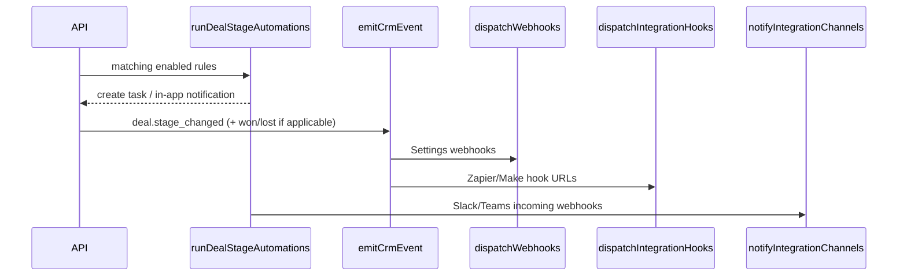

# CRM Manager

A React **revenue + work operating system** inspired by Monday.com, ClickUp, and HubSpot — with a **PostgreSQL-backed API**, JWT session cookies, OIDC SSO, webhooks, and API keys for integrations.

**Documentation map:** [What’s implemented](#whats-implemented) · [Pages & features](#pages--features) · [Starter content](#starter-content-bootstrap) · [REST API](#rest-api-reference) · [Data model](#data-model-postgresql) · [Webhook events](#webhook-events-reference) · [Integrations](#integrations)

---

## Architecture

| Layer | Stack |
|-------|--------|
| **Frontend** | React 19, TypeScript, Vite 6, Tailwind 4, React Router 7 |
| **API** | Express, Prisma, PostgreSQL, Zod validation |
| **Auth** | Email/password, refresh tokens (httpOnly cookies), Google / Microsoft / OIDC SSO |
| **Integrations** | Per-org connectors (Slack, Teams, HubSpot, …), signed outbound webhooks, API keys (`crm_…`) |

```
Browser (5173) ──proxy──► API (3001) ──► PostgreSQL (5432)
                /api/*              Prisma
```

---

## Quick start (full stack)

**Prerequisites:** Node 20+

### Database: pick one

| Option | Best for |
|--------|----------|
| **[Neon](https://neon.tech)** (free) | Testing without Docker — recommended |
| **[Supabase](https://supabase.com)** (free) | Same; also gives a dashboard |
| **Docker** `npm run db:up` | Local Postgres when Docker Desktop is installed |

#### Free cloud DB (no Docker) — ~2 minutes

1. Sign up at [neon.tech](https://neon.tech) (or [supabase.com](https://supabase.com) → New project).
2. Copy the **PostgreSQL connection string** (Neon: use the **direct** / non-pooled URL for setup).
3. Paste into `server/.env` as `DATABASE_URL`. Add `?sslmode=require` at the end if the string doesn’t include SSL params.
4. Set `JWT_SECRET` and `REFRESH_SECRET` (any long random strings, 32+ chars).

```bash
npm install
npm run db:setup       # creates tables + demo user (no db:up needed)
npm run dev
```

**Port 5432 blocked?** (common on school/work Wi‑Fi) Use Neon over HTTPS instead:

```bash
npm run db:setup:neon
npm run dev
```

```bash
npm install
npm run db:up          # only if using Docker
cp .env.example server/.env
npm run db:setup
npm run dev            # web :5173 + API :3001
```

1. Open [http://localhost:5173](http://localhost:5173)
2. Sign in with **admin@crm.local** / **demo1234** (after seed), or register a new org
3. Use **⌘K** / **Ctrl+K** for navigation — see [Pages & features](#pages--features) for what each screen does

### Invite teammates

Admins and managers can invite users from **Settings → Team**:

1. Enter email and role, click **Send invite**
2. Copy the invite link and share it (valid 7 days)
3. The invitee opens the link, sets a password (or signs in if they already have an account), and joins your workspace

Invite links use `FRONTEND_URL` in `server/.env` (default `http://localhost:5173`). After pulling invite changes, apply the schema:

```bash
npm run db:setup:neon   # or npm run db:push --prefix server && npx prisma generate --prefix server
```

### Workspace failed to load (Prisma / missing column)

If sign-in works but you see **“Signed in but workspace failed to load”** and the server log mentions **`column … does not exist`** on `bootstrap` / `membership.findUnique`, your **Postgres schema is behind** the Prisma schema in this repo.

1. **Recommended:** push schema and regenerate the client:

   - From the **repo root** (`CRM-Manager/`): `npm run db:push --prefix server`
   - If you are **already in** `server/`, run **`npm run db:push` only** — do not add `--prefix server` (npm would look for `server/server/package.json` and fail with `ENOENT`).

2. **Or** apply the bootstrap column patch without TCP 5432:
   - Neon **SQL editor:** paste and run `server/prisma/fix-bootstrap-columns.sql`, or
   - From **`server/`:** `npm run db:fix:bootstrap` (same SQL over Neon HTTPS; safe to re-run).
   Then restart the API.

After that, sign in again.

### Prisma `P1001` — “Can’t reach database server”

`prisma db push` uses **TCP to port 5432**. If you see **P1001** for your Neon host, the client never established a connection (this is not a “wrong password” error).

Try, in order:

1. **Neon project awake** — In the [Neon console](https://console.neon.tech), open the project and branch. A suspended compute wakes on dashboard use; copy a **fresh** `DATABASE_URL` into `server/.env` if the project was recreated or rotated.
2. **Network** — Corporate or school Wi‑Fi often blocks outbound **5432**. Try another network (e.g. phone hotspot) or VPN off/on.
3. **Connection string** — Prefer Neon’s **direct** (non-pooled) URL for local Prisma when troubleshooting; ensure the URL includes SSL (e.g. `?sslmode=require`) if Neon’s copy button didn’t add it.
4. **No TCP at all** — Fix **missing bootstrap columns** without port 5432:
   - **Browser:** run `server/prisma/fix-bootstrap-columns.sql` in Neon’s **SQL editor**, or
   - **Terminal (from `server/`):** `npm run db:fix:bootstrap` (applies that file over Neon HTTPS; does not wipe data).
   Then restart the API.

**Avoid** `npm run db:push:neon` / `db:setup:neon` on a database you care about: the Neon HTTP helper script **drops and recreates `public` by default** (fresh schema only). Use normal `db:push` over TCP once connectivity works.

### SSO (optional)

Set credentials in `server/.env`:

| Provider | Variables |
|----------|-----------|
| Google | `GOOGLE_CLIENT_ID`, `GOOGLE_CLIENT_SECRET` |
| Microsoft | `AZURE_AD_CLIENT_ID`, `AZURE_AD_CLIENT_SECRET`, `AZURE_AD_TENANT_ID` |
| Generic OIDC | `OIDC_ISSUER`, `OIDC_CLIENT_ID`, `OIDC_CLIENT_SECRET` |

Redirect URIs must point at your API host, e.g. `http://localhost:3001/api/auth/sso/google/callback`.

### Programmatic API access

1. Sign in → **Settings → Security** → create an API key (shown once).
2. Call endpoints with `Authorization: Bearer crm_…` or header `X-API-Key: crm_…`.
3. Discover routes: `GET /api/v1/openapi` (stub) or see `server/src/routes/v1/index.ts`.

Core routes: `GET /api/v1/bootstrap`, CRUD for contacts/deals/companies/leads/tasks, activities, comments, `GET /api/v1/search?q=`, `GET|PATCH /api/v1/integrations`, webhooks, preferences. Full tables: [REST API reference](#rest-api-reference). Connectors: [Integrations](#integrations).

---

## What’s implemented

### Product (UI)

- **20+ routes** — dashboard, CRM objects (contacts, leads, companies, deals, products), tasks, boards, calendar, goals, reports, automations, marketing, support, inbox, docs, integrations, settings
- **Record drawer** — activities, tasks, quotes, contracts, approvals, comments, files, related records
- **Command palette** (⌘K), **quick-create FAB**, list filters, CSV import/export on contacts & leads
- **Dashboard** — pipeline funnel, activity feed, AI-style next-best-action hints (heuristic)
- **Docs** — full-page rich-text editor (`/docs/new`, `/docs/:id`), not a modal
- **Inbox** — team channel + direct messages between users; inbound mail-style threads
- **Integrations hub** (`/integrations`) — eight connectors with enable/disable, masked secrets, **Test connection**, **Sync** (HubSpot), OAuth connect for Gmail/Outlook when SSO env is set
- **Command palette search** — server-side `GET /api/v1/search?q=` (2+ chars) across contacts, companies, deals, leads, docs
- **UX** — dark mode, **PageFrame** heroes (per-page accent colors), glass panels & kanban columns, theme toggle, login success animation, workspace skeleton loader, header user menu (account / sign out)
- **Starter workspace** — on each bootstrap, missing demo entities are auto-created (goals, sprints, calendar, forms, tasks, board, etc.) — see [Starter content](#starter-content-bootstrap)
- **Tag picker** — multi-tag assignment on contacts, leads, deals (create tags in Settings → Workspace)
- **List filter bar** — search, stage filters, saved views (`localStorage`) on CRM list pages
- **Notification bell** — mark read / mark all; links from automations and approvals

### Platform (API + data)

- [x] **PostgreSQL** + Prisma, multi-tenant `Organization`
- [x] **REST API** `/api/v1/*` — CRUD for core entities, bootstrap, preferences, pipeline stages
- [x] **Auth** — register, login, refresh cookies, invites (`/invite/:token`), optional Google / Microsoft / OIDC SSO
- [x] **Team invites** — email link, role on join (Settings → Team)
- [x] **Integration connections** — `IntegrationConnection` per org; catalog in `server/src/lib/integrations/catalog.ts`; auto-provisioned on bootstrap
- [x] **Outbound webhooks** — HMAC-signed `POST` to URLs in Settings; events include `contact.*`, `lead.*`, `deal.*` (see [Outbound webhooks](#outbound-webhooks-settings))
- [x] **API keys** — Bearer / `X-API-Key` for programmatic access
- [x] **Automations** — deal stage rules (tasks + in-app notify); all stage moves also post to enabled Slack/Teams webhooks
- [x] **Global search API** — `GET /api/v1/search?q=` (authenticated)
- [x] **CRM event fan-out** — `emitCrmEvent` → Settings webhooks + Zapier/Make hooks
- [x] **Profile API** — `PATCH /api/auth/profile`, `POST /api/auth/change-password`
- [x] **Audit log** on key mutations
- [x] **Extras** — quotes, contracts, approvals, campaigns, time entries, NPS surveys, contact merge, file metadata
- [x] **Sprints API** — `POST /api/v1/sprints` (Goals page UI)
- [x] **Starter content service** — `ensureOrgStarterContent` on bootstrap (idempotent per entity type)
- [x] **Invites API** — `GET/POST/DELETE /api/v1/invites` (admin/manager)
- [x] **Inbox API** — team + DM messages, per-user read state
- [x] **Lead convert** — `POST /api/v1/leads/:id/convert` with webhook fan-out
- [x] **Lead scoring** — heuristic on create/update/import (`computeLeadScore`)
- [x] **Webhook delivery log** — `WebhookDelivery` rows per outbound POST
- [x] **Contact merge** — transactional re-point + delete duplicate

### Known gaps (UI exists, backend partial or stub)

| Area | Today |
|------|--------|
| Email send | Logged to timeline only — no SMTP / Gmail send |
| Gmail / Outlook | “Connect” marks connected when SSO works; no Gmail/Graph sync jobs yet |
| HubSpot sync | Imports up to 5 contacts per sync; no companies/deals/two-way sync |
| Stripe | Keys stored; no inbound Stripe webhook route or deal↔payment matching |
| Zapier / Make | Catch hooks receive the same events as Settings webhooks when enabled |
| Calendar | Local events; calendar ingest not wired to integrations |
| Saved views & segments | Types + UI hooks; `savedViews` / `segments` empty in bootstrap |
| Files | Metadata in DB; no S3 / blob upload yet |
| Marketing forms | Starter form on bootstrap; no form builder UI; limited public `POST` embed API |
| Sprints | Create only (no edit/delete API or UI) |
| Board cards | Create + move; no edit/delete card UI |
| OpenAPI | Stub at `GET /api/v1/openapi` |
| RBAC | Roles on users; not every route enforces manager/admin yet |

---

## Routes (app)

| Path | Page | Accent |
|------|------|--------|
| `/login` | Sign in / register / SSO | — |
| `/invite/:token` | Accept team invite | — |
| `/` | Dashboard | custom hero |
| `/contacts` | Contacts | violet |
| `/leads` | Leads | sky |
| `/companies` | Companies | emerald |
| `/deals` | Deals | brand |
| `/products` | Product catalog | amber |
| `/tasks` | Tasks | amber |
| `/boards` | Boards | violet |
| `/calendar` | Calendar | sky |
| `/goals` | Goals & workload | emerald |
| `/reports` | Reports | violet |
| `/automations` | Automations | rose |
| `/integrations` | Integrations hub | brand |
| `/marketing` | Marketing | rose |
| `/support` | Support | sky |
| `/inbox` | Team inbox & DMs | brand |
| `/docs` | Document list | violet |
| `/docs/new`, `/docs/:id` | Rich-text doc editor | full-screen |
| `/settings` | Workspace admin | brand |

---

## Pages & features

How each screen works today: what you can click, what hits the API, and what is still UI-only. Data loads from `GET /api/v1/bootstrap` unless noted.

### Shared UX (all authenticated pages)

| Feature | Where | Behavior |
|---------|--------|----------|
| **Command palette** | ⌘K / Ctrl+K | Jump to any main route; type 2+ chars for `GET /api/v1/search?q=` (contacts, companies, deals, leads, docs). Tasks filter locally. Selecting a record navigates to the list page (not the drawer). |
| **Quick-create FAB** | Bottom-right | Create contact, deal, or task with minimal fields; deal/task navigates to that page after save. |
| **Record drawer** | Contacts, leads, companies, deals, dashboard | Slide-over with timeline, tasks (read-only + link to Tasks), quotes/contracts/approvals (deals), comments, email log, files (≤2MB data URLs), related records, custom fields, heuristic “AI insight”. |
| **List filters** | Contacts, leads, companies, deals | Search + stage/score filters; **saved views** in `localStorage` only (not server). |
| **Import / export** | Contacts, leads, deals toolbar | CSV export from loaded data; import API for contacts & leads only (`POST …/import`). Deals: export only. |
| **Notifications** | Header bell | In-app notifications from bootstrap; mark one/all read; digest toggles in Settings. |
| **Theme** | Header toggle + Settings → Profile | Light / dark via preferences API. |
| **Regional** | Settings → Profile | Currency (ISO 4217), locale (BCP 47), and IANA time zone for amounts and dates across the app. |
| **Tags** | Contact / lead / deal modals | `TagPicker` — org tags from Settings → Workspace. |
| **Header search** | Click search in app bar | Opens command palette (same as ⌘K). |

---

### Dashboard (`/`)

Custom layout (not `PageFrame`) with gradient hero and quick stats.

| Area | Features |
|------|----------|
| **Hero** | Greeting, open deals / pending tasks counts, shortcuts to Deals, Contacts, Inbox, Reports. |
| **KPI cards** | Open pipeline $, weighted forecast, won revenue & win rate, contact & company counts, pending / overdue tasks. |
| **Priorities** | Heuristic “next best actions” (`src/lib/ai.ts` — not an LLM). |
| **Pipeline funnel** | Bar chart by stage (excludes lost). |
| **Activity feed** | Last 10 activities from bootstrap. |
| **Recent deals** | Click row → **record drawer** (deal). |
| **Hot leads** | Top 5 by score → link to Leads list. |
| **Quick access** | Cards for Contacts, Companies, Deals, Products, Integrations, Tasks, Calendar, Reports. |

**API:** None on this page — all computed from bootstrap.

---

### Contacts (`/contacts`)

| Feature | Details |
|---------|---------|
| **List** | Sortable table: name (opens drawer), email, company, title. |
| **Filters** | Search + saved views (`ListFilterBar`). |
| **Create / edit** | Modal: name, email, phone, company, title, owner, tags. |
| **Merge** | Pick primary + duplicate → `POST /api/v1/contacts/merge` (see [Contact merge](#contact-merge)). |
| **Import / export** | CSV via `ImportExportBar`. |
| **Delete** | Confirm dialog → contact DELETE. |
| **Drawer** | Log call / meeting / note, comments, files, custom fields, email log (activity only). |

---

### Leads (`/leads`)

| Feature | Details |
|---------|---------|
| **List** | Score badge, stage, source, UTM, owner; name opens drawer. |
| **Filters** | Search, stage, minimum score, saved views. |
| **Convert** | `POST /api/v1/leads/:id/convert` — creates contact, updates lead (fires `lead.converted` + `contact.created` webhooks). |
| **Import / export** | CSV import/export. |
| **Scoring** | Server-side on create/update/import — see [Lead scoring](#lead-scoring). |

---

### Companies (`/companies`)

| Feature | Details |
|---------|---------|
| **Layout** | Card grid (`page-card-grid`) with health %, industry, website, contact count. |
| **Filters** | Search + saved views. |
| **Create / edit** | Name, industry (chips + custom), website, phone, owner, territory, parent company, health slider (0–100). |
| **Drawer** | Same pattern as contacts; related deals/contacts on deal records. |

---

### Deals (`/deals`)

| Feature | Details |
|---------|---------|
| **Views** | **Board** (kanban) or **Table** via segmented control. |
| **Pipeline** | Columns from `pipelineStages`; drag card → `PATCH` deal `stageKey` (automations + webhooks + Slack/Teams). |
| **Inline edit** | Title, value, stage, close date, owner on board cards / table rows. |
| **Create** | Modal: title, value, stage, expected close, contact, company, owner, tags. |
| **Export** | CSV export only. |
| **Drawer** | Quotes, contracts, approvals panels + standard timeline / files / comments. |

---

### Products (`/products`)

| Feature | Details |
|---------|---------|
| **Item master** | Table: SKU, name, category, UoM, list price, **internal cost**, status. Search across name/SKU/category/description. |
| **Editor** | Modal sections: core, pricing & inventory, merchandising (image URL + long description), **specifications** (name/value rows for ERP-style attributes). |
| **Storefront feed** | **Create catalog URL** generates a secret token; copy the read-only JSON URL for your website. **Regenerate** rotates the token (old URLs stop working). **Revoke** disables public access. Public JSON includes **active** products only; **cost is never exposed**. |
| **Use** | Product picker in deal **quotes** (drawer). |

**API (auth):** `POST/PATCH/DELETE /api/v1/products` (rich product body). `POST /api/v1/product-catalog-feed` creates/rotates the public token; `DELETE /api/v1/product-catalog-feed` revokes it.

**API (public, no auth):** `GET /api/public/catalog/:token` — JSON `{ organization, asOf, products[] }` with `Access-Control-Allow-Origin: *` for browser fetch from your site.

---

### Tasks (`/tasks`)

| Feature | Details |
|---------|---------|
| **Filters** | Chip pills: All / To do / In progress / Done. |
| **List** | Toggle complete, edit, delete, **log time** (minutes + note). |
| **Create / edit** | Title, description, due date, priority, status, optional contact & deal links. |
| **Time** | `POST /api/v1/time-entries` — rolled up on Goals page. |

No record drawer on this page.

---

### Boards (`/boards`)

| Feature | Details |
|---------|---------|
| **Board picker** | Dropdown of workspaces; **New board** modal. |
| **Views** | Board (drag-drop kanban), Table, Calendar (cards with due dates), Timeline (simple bars — not full Gantt). |
| **Cards** | Add card to column; drag between columns → `moveBoardItem`. |
| **Empty state** | **New board** CTA when no boards exist. |
| **Gaps** | No UI to rename columns or edit/delete cards; column CRUD not exposed. |

---

### Calendar (`/calendar`)

| Feature | Details |
|---------|---------|
| **List** | Upcoming meetings sorted by start time. |
| **CRUD** | Title, start/end, link to contact / deal / company. |
| **Sync field** | `externalSync`: none \| google \| outlook (stored; live sync via integrations not wired). |
| **Starter** | Two sample meetings (deal discovery + company check-in) on bootstrap when empty. |

---

### Goals (`/goals`)

| Feature | Details |
|---------|---------|
| **OKRs** | Create / edit / delete goals; title, quarter, owner, target $, current progress; progress bar. |
| **Sprints** | List with date range + linked task count; **Add sprint** modal → `POST /api/v1/sprints` (name, start, end, team). |
| **Workload** | Per-rep open task count + minutes logged from time entries (includes starter time entry when empty). |
| **Starter** | Sample Q2 revenue goal + 2-week sprint created on first bootstrap if missing. |

---

### Reports (`/reports`)

| Feature | Details |
|---------|---------|
| **Summary stats** | Weighted forecast, won YTD, open deal count. |
| **Funnel** | Stage bars with count & value; **Export CSV**. |
| **Activity by rep** | Activity count per user. |
| **AI actions** | Same heuristics as Dashboard. |
| **Retention** | Avg company health + survey count (minimal metrics). |
| **Empty funnel** | Hint to add deals when pipeline is empty. |

---

### Automations (`/automations`)

| Feature | Details |
|---------|---------|
| **Rules** | When deal enters stage X → notify owner or create task; enable toggle, delete. |
| **Sequences** | Read-only list with step counts; starter nurture flow on bootstrap. |
| **Webhooks** | List from bootstrap; empty state links to **Settings → Webhooks**. |
| **Integrations** | On/off summary; link to `/integrations` when empty. |
| **Approvals** | Approve / decline pending items where you are the approver; starter pending approval when a deal exists. |

**Runtime:** Stage-change rules run server-side on deal `PATCH`; see [Slack & Teams](#slack--teams--deal-notifications).

---

### Marketing (`/marketing`)

| Feature | Details |
|---------|---------|
| **Forms** | Cards: field count, submissions, embed path `/embed/form/{id}`, latest submission preview. Empty state explains bootstrap seed. |
| **Campaigns** | CRUD: name, UTM source/medium, budget; lead count by matching `utmSource`; empty state + **New campaign**. |
| **Attribution** | Up to 8 leads with UTM labels. |
| **Nurture sequences** | Panel lists each sequence, step count, active/paused. |
| **Stubs** | Meeting scheduler (`/book/demo`) and live chat noted as coming soon. |
| **Starter** | Demo request form + website campaign + 2-step email sequence on bootstrap. |

---

### Support (`/support`)

| Feature | Details |
|---------|---------|
| **Tickets** | Create with subject, description, company, priority; change status inline (`POST` + `PATCH /tickets`). |
| **Account health** | All companies’ health scores (read-only grid). |
| **NPS / CSAT** | Submit score 0–10 + feedback per company; history list. |
| **Demo seed** | Sample SSO ticket for Acme; starter survey on bootstrap when a company exists. |

---

### Inbox (`/inbox`)

| Feature | Details |
|---------|---------|
| **Filters** | All / Team / Direct / Unread (chip toolbar). |
| **Compose** | Message a **team channel** or **teammate** (internal). |
| **Inbound** | Mail-style threads in bootstrap; reply on external thread logs email activity if sender matches a contact. |
| **Read state** | Mark one or all read. |

**API:** `POST /api/v1/inbox`, inbox read endpoints. Requires inbox columns in DB — see [Scripts](#scripts) if bootstrap fails.

---

### Docs (`/docs`, `/docs/new`, `/docs/:id`)

| Route | Features |
|-------|----------|
| **`/docs`** | Card grid with HTML preview, updated date, record link; delete; **New doc** → editor. |
| **`/docs/new`** | Full-screen **rich-text editor**; link to CRM record; save creates doc then redirects. |
| **`/docs/:id`** | Autosave (2s debounce) + manual save; update title & body. |

**API:** Document CRUD; included in global search. Details: [Document editor](#document-editor-docsnew-docsid).

---

### Integrations (`/integrations`)

| Feature | Details |
|---------|---------|
| **Catalog** | Eight connectors grouped by category (chat, calendar, automation, CRM, billing). |
| **Per card** | Enable, masked credential fields, Save, **Test connection**, **Sync** (HubSpot), OAuth **Connect** when SSO env is set. |
| **Health** | Last test time / ok on connection config. |

Settings → Integrations tab shows a read-only **health summary**; full editing happens here or via API.

---

### Settings (`/settings`)

Deep-link tabs with `?tab=Profile` etc.

| Tab | What you can do |
|-----|-----------------|
| **Profile** | Display name, theme (light/dark), change password — new passwords must be **8+ characters** with **uppercase**, **number**, and **special** character (`hasPassword` aware for SSO-only users). |
| **Workspace** | Org name, member/team/territory counts, create **tags**. |
| **Notifications** | Email digest & push preference toggles. |
| **Integrations** | `IntegrationHealthSummary` — enabled connectors & last test status. |
| **Webhooks** | Add URL + secret + event filter; test delivery; view delivery log. |
| **Pipeline** | Edit stage label, win probability %, color per stage. |
| **Fields** | List custom field definitions; add text field on **deals**. |
| **Team** | Invite by email + role (admin/manager); copy invite link; revoke; member list. |
| **Security** | SSO provider status; create/list/revoke **API keys** (`crm_…`). |
| **Audit** | Last 100 audit log entries (read-only). |
| **Data** | Reload workspace; OpenAPI hint (`GET /api/v1/openapi` stub). |

---

### Login & invite

| Route | Features |
|-------|----------|
| **`/login`** | Register new org, email/password sign-in, SSO buttons when configured, demo credentials hint, success animation → Dashboard. |
| **`/invite/:token`** | Preview org, email, role, expiry; set name/password for new users; accept → join workspace → `/`. |

---

### Record drawer (all record types)

Open from list rows or Dashboard recent deals. Tabs vary by `recordType`.

| Tab | Contacts / leads / companies | Deals |
|-----|------------------------------|-------|
| **Timeline** | Log call, meeting, note → `POST /activities` | Same |
| **Tasks** | Linked tasks (read-only); link to `/tasks` | Same |
| **Email** | Log subject/body as email activity (no SMTP send) | Same |
| **Comments** | @mentions stored; `POST /comments` | Same |
| **Files** | Upload ≤2MB (data URL) → `POST /files` | Same |
| **Related** | — | Contact, company, sibling deals |
| **Custom fields** | If defs exist for entity | Deal custom fields |
| **AI insight** | Heuristic summary (`summarizeRecord`) | Same |
| **Quotes** | — | Line items from product catalog |
| **Contracts** | — | Title, status, sign URL |
| **Approvals** | — | Request + approve/decline |

Deal extras use `/api/v1/quotes`, `/contracts`, `/approvals` (see [CRM extras](#crm-extras)).

---

### Sidebar layout

| Section | Pages |
|---------|--------|
| Overview | Dashboard |
| CRM | Contacts, Leads, Companies, Deals, Products |
| Work | Tasks, Boards, Calendar, Goals, Docs |
| Growth | Reports, Automations, Marketing |
| Connect | Inbox (unread badge), Support, Integrations |

Settings: user menu in header (not in sidebar list).

---

## Starter content (bootstrap)

On every `GET /api/v1/bootstrap`, the server runs `ensureOrgStarterContent` (`server/src/services/ensureStarterContent.ts`). For each entity type, if the org has **zero** rows, it creates sample data **once** (safe to call repeatedly).

| Entity | What gets created |
|--------|-------------------|
| **Goal** | Q2 new business revenue OKR ($250k target, partial progress) |
| **Sprint** | “Sprint 24 — Pipeline push” (14 days, first team) |
| **Calendar** | Discovery call (linked to deal if any) + company check-in |
| **Marketing form** | “Demo request” with 3 fields + 1 sample submission |
| **Email sequence** | “New lead nurture” — 2 steps, enabled |
| **Campaign** | “Website inbound” (UTM website/organic) |
| **Board** | “Getting started” with 3 columns + onboarding card |
| **Tasks** | Pipeline review + connect Slack (linked to deal/sprint when possible) |
| **Activity** | Deal note (if a deal exists) |
| **Survey** | NPS 9/10 for first company |
| **Approval** | Pending discount approval on first deal |
| **Automation** | Proposal stage → create follow-up task |
| **Time entry** | 45 min on first task (powers Goals workload) |

**New registrations** get pipeline + team from signup, then starter content on first bootstrap. **Demo seed** (`npm run db:setup`) still creates Acme/deal/board/ticket data; bootstrap fills anything still missing.

To refresh starter items after manual deletes, create records via the UI or re-run targeted SQL — bootstrap will not duplicate existing types.

---

## Design system

| Piece | Role |
|-------|------|
| **`PageFrame`** | Page wrapper: hero header, optional toolbar, `page-shell` body |
| **`PageHeader`** | Gradient hero with title, description, action buttons |
| **`page-hero--{accent}`** | CSS accent: `brand`, `violet`, `emerald`, `sky`, `amber`, `rose` |
| **`page-toolbar`** | Filter row below hero (Inbox chips, Deals/Boards view toggle) |
| **`panel` / `panel-pad`** | Glass cards for sections and tables |
| **`kanban-column`** | Pipeline/board columns with header + card list |
| **`chip-filter`** | Rounded filter pills (Tasks, Inbox) |
| **`segmented-control`** | Board vs table toggle (Deals, Boards) |
| **`page-card-grid`** | Responsive card grid (Companies, Docs) |

**Exceptions:** Dashboard uses a custom gradient layout; Login, Invite, and the doc editor are full-screen without `PageFrame`.

---

## AI heuristics (client-side)

Not connected to an LLM. Logic lives in `src/lib/ai.ts`.

| Function | Used on | Rules |
|----------|---------|-------|
| **`getNextBestActions`** | Dashboard, Reports | Overdue tasks, past-due deal close dates, hot leads (score ≥70), pending approvals for current user |
| **`summarizeRecord`** | Record drawer “AI insight” tab | Template string from activity + open task counts |

Replace with a real copilot by swapping these call sites for an API route (see roadmap).

---

## REST API reference

All `/api/v1/*` routes require a session cookie **or** API key (`Authorization: Bearer crm_…` / `X-API-Key`). Auth routes use `/api/auth/*`. **Public** routes under `/api/public/*` require no credentials (see catalog below).

### Workspace

| Method | Path | Notes |
|--------|------|--------|
| `GET` | `/api/v1/bootstrap` | Full workspace snapshot (`CrmState` shape); runs integrations + starter content hooks |
| `GET` | `/api/v1/search?q=` | Global search (2+ chars): contacts, companies, deals, leads, documents |
| `PATCH` | `/api/v1/preferences` | Theme, email digest, push toggles, `currency`, `locale`, `timezone` |
| `GET` | `/api/v1/openapi` | Stub OpenAPI JSON |
| `POST` | `/api/v1/product-catalog-feed` | Create or **rotate** storefront catalog secret; response `{ token, url }` (absolute `API_URL`) |
| `DELETE` | `/api/v1/product-catalog-feed` | Revoke catalog token |

### Public catalog (no auth)

| Method | Path | Notes |
|--------|------|--------|
| `GET` | `/api/public/catalog/:token` | Active products JSON for websites; `Access-Control-Allow-Origin: *`; **no cost fields** |
| `OPTIONS` | `/api/public/catalog/:token` | CORS preflight |

### CRM core (`/api/v1`)

| Resource | Create | Update | Delete | Extra |
|----------|--------|--------|--------|-------|
| Contacts | `POST /contacts` | `PATCH /contacts/:id` | `DELETE /contacts/:id` | `POST /contacts/import` |
| Companies | `POST /companies` | `PATCH /companies/:id` | `DELETE /companies/:id` | |
| Deals | `POST /deals` | `PATCH /deals/:id` | `DELETE /deals/:id` | Stage change → automations, webhooks, Slack/Teams |
| Leads | `POST /leads` | `PATCH /leads/:id` | `DELETE /leads/:id` | `POST /leads/:id/convert`, `POST /leads/import` |
| Tasks | `POST /tasks` | `PATCH /tasks/:id` | `DELETE /tasks/:id` | |
| Products | `POST /products`* | `PATCH /products/:id`* | `DELETE /products/:id`* | *via `crmExtras` router |
| Calendar | `POST /calendar-events` | `PATCH /calendar-events/:id` | `DELETE /calendar-events/:id` | |
| Goals | `POST /goals` | `PATCH /goals/:id` | `DELETE /goals/:id` | |
| Sprints | `POST /sprints` | — | — | |
| Documents | `POST /documents` | `PATCH /documents/:id` | `DELETE /documents/:id` | |
| Activities | `POST /activities` | — | — | Timeline / email log |
| Comments | `POST /comments` | — | — | |
| Automations | `POST /automations` | `PATCH /automations/:id` | `DELETE /automations/:id` | |
| Tickets | — | `PATCH /tickets/:id` | — | Create via extras |
| Notifications | `PATCH /notifications/:id/read` | — | — | `POST /notifications/read-all` |

### CRM extras

| Method | Path | Purpose |
|--------|------|---------|
| `POST` | `/tags` | Create workspace tag |
| `POST` | `/quotes` | Deal quote + line items |
| `PATCH` | `/quotes/:id` | Quote status |
| `DELETE` | `/quotes/:id` | |
| `POST` | `/contracts` | Deal contract |
| `PATCH` | `/contracts/:id` | |
| `POST` | `/approvals` | Request approval |
| `PATCH` | `/approvals/:id` | Approve / reject |
| `POST` | `/files` | File metadata (base64 body) |
| `DELETE` | `/files/:id` | |
| `POST` | `/boards` | Board + default columns |
| `POST` | `/board-items` | Card |
| `PATCH` | `/board-items/:id` | Move column / update |
| `DELETE` | `/board-items/:id` | |
| `POST` | `/campaigns` | Marketing campaign |
| `PATCH` | `/campaigns/:id` | |
| `DELETE` | `/campaigns/:id` | |
| `POST` | `/tickets` | Support ticket |
| `POST` | `/surveys` | NPS / CSAT |
| `POST` | `/time-entries` | Log time on task |
| `POST` | `/inbox` | Team or DM message |
| `PATCH` | `/inbox/:id/read` | Mark read |
| `POST` | `/contacts/merge` | Merge duplicate contacts |
| `PATCH` | `/pipeline-stages/:id` | Label, probability, color |
| `POST` | `/custom-field-defs` | Add custom field (deals in UI) |
| `PUT` | `/custom-field-values` | Set values on a record |

### Auth & team (`/api/auth`, `/api/v1/invites`)

| Method | Path | Purpose |
|--------|------|---------|
| `POST` | `/api/auth/register` | New org + admin user |
| `POST` | `/api/auth/login` | Session cookies |
| `POST` | `/api/auth/refresh` | Rotate access token |
| `POST` | `/api/auth/logout` | Clear cookies |
| `GET` | `/api/auth/me` | Current user, org, role, `hasPassword` |
| `PATCH` | `/api/auth/profile` | Display name |
| `POST` | `/api/auth/change-password` | |
| `GET` | `/api/auth/sso/providers` | Which SSO buttons to show |
| `GET` | `/api/auth/sso/:provider` | Start OAuth |
| `GET` | `/api/auth/invite/:token` | Invite preview |
| `POST` | `/api/auth/accept-invite` | Join org |
| `GET` | `/api/v1/invites` | List pending (admin/manager) |
| `POST` | `/api/v1/invites` | Send invite |
| `DELETE` | `/api/v1/invites/:id` | Revoke |

### Integrations & webhooks

| Method | Path | Purpose |
|--------|------|---------|
| `GET` | `/api/v1/integrations` | Catalog + org connections |
| `PATCH` | `/api/v1/integrations/:type` | Enable, save config |
| `POST` | `/api/v1/integrations/:type/test` | Test connection |
| `POST` | `/api/v1/integrations/:type/sync` | HubSpot import, etc. |
| `GET` | `/api/v1/webhooks` | List endpoints |
| `POST` | `/api/v1/webhooks` | Create endpoint |
| `POST` | `/api/v1/webhooks/:id/test` | Send `webhook.test` event |
| `GET` | `/api/v1/api-keys` | List keys (prefix only) |
| `POST` | `/api/v1/api-keys` | Create key (full secret once) |

See [Integrations](#integrations) for connector-specific behavior.

---

## Key components

| Component | Path | Role |
|-----------|------|------|
| `RecordDrawer` | `src/components/RecordDrawer.tsx` | Slide-over CRM record with tabs |
| `DealQuotesPanel` | `src/components/deals/` | Quote builder in drawer |
| `DealContractsPanel` | | Contracts on deals |
| `DealApprovalsPanel` | | Approval workflow |
| `CommandPalette` | `src/components/CommandPalette.tsx` | ⌘K navigation + search |
| `QuickCreateFab` | | FAB: contact, deal, task |
| `ImportExportBar` | | CSV import/export |
| `ListFilterBar` | | Search + saved views |
| `TagPicker` | | Multi-select tags |
| `IntegrationCard` | `src/components/integrations/` | Connector config UI |
| `IntegrationHealthSummary` | `src/components/settings/` | Settings integrations tab |
| `PipelineStageRow` | | Settings pipeline editor |
| `ActivityFeed` | `src/components/dashboard/` | Dashboard timeline |
| `PipelineFunnel` | | Dashboard funnel chart |
| `RichTextEditor` | `src/components/docs/` | Docs WYSIWYG (HTML) |
| `WorkspaceLoader` | | Bootstrap loading skeleton |
| `DealInlineFields` | `src/components/deals/` | Kanban/table inline deal edit |
| `LoginSuccessSplash` | `src/components/auth/` | Post-login animation |

---

## Data model (PostgreSQL)

Multi-tenant: every business row has `organizationId`. Users join orgs via **Membership** (role + optional team/territory).

```mermaid
erDiagram
  Organization ||--o{ Contact : has
  Organization ||--o{ Company : has
  Organization ||--o{ Deal : has
  Organization ||--o{ Lead : has
  Company ||--o{ Contact : employs
  Company ||--o{ Deal : accounts
  Contact ||--o{ Deal : influences
  Deal ||--o{ Quote : has
  Deal ||--o{ Contract : has
  Deal ||--o{ Approval : has
  Pipeline ||--o{ PipelineStage : stages
  Deal }o-- PipelineStage : current
  Board ||--o{ BoardColumn : columns
  BoardColumn ||--o{ BoardItem : cards
  Team ||--o{ Sprint : runs
  Task }o-- Sprint : optional
```

| Model | Purpose |
|-------|---------|
| `Organization`, `Membership`, `Team`, `Territory` | Tenancy, roles, structure |
| `User`, `UserPreference`, `RefreshToken` | Auth, theme, sessions |
| `OrganizationInvite` | 7-day email invites |
| `Company`, `Contact`, `Lead`, `Deal` | Core CRM |
| `ContactTag`, `DealTag`, `LeadTag` | Many-to-many tags |
| `Pipeline`, `PipelineStage` | Deal stages + win probability |
| `Task`, `TimeEntry`, `Sprint`, `Goal` | Work management |
| `Activity`, `Comment`, `EmailLog` | Timeline & comms history |
| `CalendarEvent` | Meetings linked to records |
| `Product`, `Quote`, `Contract` | Catalog & deal commerce |
| `Approval` | Discount / sign-off workflow |
| `Board`, `BoardColumn`, `BoardItem` | Custom kanban workspaces |
| `Document` | Wiki pages (HTML) |
| `MarketingForm`, `Campaign`, `EmailSequence` | Marketing |
| `Ticket`, `Survey` | Support & NPS |
| `InboxMessage` | Team channel + DMs |
| `AutomationRule` | Deal-stage triggers |
| `WebhookEndpoint`, `WebhookDelivery` | Outbound HTTP + delivery log |
| `IntegrationConnection` | Slack, HubSpot, etc. |
| `ApiKey` | Programmatic access |
| `CustomFieldDef`, `CustomFieldValue` | Extensible deal fields |
| `FileAttachment` | File metadata (bytes optional) |
| `Notification` | In-app alerts |
| `AuditLog` | Settings audit trail |

Schema source: `server/prisma/schema.prisma`.

---

## Bootstrap snapshot (`CrmState`)

`GET /api/v1/bootstrap` returns one JSON object matching `src/types/index.ts` → `CrmState`. The SPA stores it in React context (`CrmProviderApi`) and re-fetches after mutations.

| Field | Contents |
|-------|----------|
| `session` | `userId`, `email`, `loggedInAt` (null if logged out) |
| `preferences` | `theme`, `emailDigest`, `pushEnabled`, `currency`, `locale`, `timezone` |
| `users`, `teams`, `territories`, `workspaces` | Org directory |
| `tags` | Label + color |
| `companies`, `contacts`, `leads` | CRM records |
| `pipelines`, `pipelineStages` | Default pipeline + stage config |
| `deals` | Open/won/lost with `stage`, `value`, relations |
| `tasks`, `timeEntries`, `sprints`, `goals` | Work |
| `activities`, `emailLogs`, `comments` | Timeline data |
| `calendarEvents` | Meetings |
| `products`, `quotes`, `contracts` | Catalog & deal extras |
| `boards`, `boardColumns`, `boardItems` | Boards |
| `documents`, `files` | Docs + attachments |
| `automations`, `emailSequences`, `webhooks`, `integrations` | Automation & connectors |
| `approvals`, `notifications`, `inbox` | Workflow & comms |
| `forms`, `campaigns`, `tickets`, `surveys` | Marketing & support |
| `customFieldDefs`, `customFieldValues` | Nested map: entity → recordId → fieldId |
| `savedViews`, `segments` | Reserved (often empty) |
| `auditLog` | Recent audit rows |

Hooks on bootstrap (server): `ensureOrgIntegrations`, `ensureOrgStarterContent`.

---

## Lead scoring

Computed server-side in `server/src/lib/lead-score.ts` on **create**, **update**, and **CSV import** (not recalculated on every read).

| Signal | Points |
|--------|--------|
| Base | +20 |
| Has email | +15 |
| Has phone | +10 |
| UTM source set (not `direct`) | +15 |
| Stage `contacted` | +10 |
| Stage `qualified` | +25 |
| Stage `converted` | → **100** |
| Stage `disqualified` | → **0** |

Cap: **100**. UI shows score on Leads list; Dashboard “hot leads” uses score ≥ **70**.

---

## Pipeline & forecasting

Default pipeline stages (seed/register): `lead` → `qualified` → `proposal` → `negotiation` → `won` / `lost`.

| Metric | Where | Formula |
|--------|-------|---------|
| **Open pipeline** | Dashboard | Sum of deal `value` where stage ∉ {won, lost} |
| **Weighted forecast** | Dashboard, Reports | Σ `value × (stage probability / 100)` for open deals |
| **Win rate** | Dashboard | won / (won + lost) |
| **Funnel** | Dashboard, Reports | Count & $ per stage (`src/lib/pipeline.ts`) |
| **Deal velocity** | Dashboard | Avg days from `createdAt` to now for won deals |

Edit stage labels, colors, and probabilities in **Settings → Pipeline** (`PATCH /api/v1/pipeline-stages/:id`).

---

## Automations & event pipeline

When a deal’s **`stageKey`** changes on `PATCH /api/v1/deals/:id`:



| Automation action | Effect |
|-------------------|--------|
| `create_task` | Task on deal owner, due +7 days, linked to deal/contact |
| `notify` | In-app `Notification` for deal owner |

`emitCrmEvent` uses `Promise.allSettled` — delivery failures never block the API response.

Other CRM mutations call `emitCrmEvent` directly (contacts, leads, deal create/delete) — see [Webhook events](#webhook-events-reference).

---

## Webhook events reference

Envelope (Settings webhooks and Zapier/Make hooks):

```json
{
  "event": "deal.stage_changed",
  "timestamp": "2026-05-19T12:00:00.000Z",
  "data": { }
}
```

Zapier/Make payloads also include `"source": "crm-manager"`.

| Event | When fired | `data` fields (typical) |
|-------|------------|-------------------------|
| `contact.created` | `POST /contacts` | `id`, name/email fields |
| `contact.updated` | `PATCH /contacts/:id` | `id` |
| `lead.created` | `POST /leads` | `id`, email, stage, score |
| `lead.converted` | `POST /leads/:id/convert` | lead + new `contactId` |
| `deal.created` | `POST /deals` | `id`, `title`, `stage`, `value` |
| `deal.stage_changed` | Deal `stageKey` changes | `id`, `title`, `from`, `to`, `value` |
| `deal.won` | Stage → `won` | Same as stage_changed |
| `deal.lost` | Stage → `lost` | Same as stage_changed |
| `deal.deleted` | `DELETE /deals/:id` | `id`, `title` |
| `webhook.test` | Settings → Test webhook | Sample payload |

**Filtering:** Webhook endpoints with an empty `events` array receive **all** events; otherwise only listed events match.

**Signing:** Optional secret → header `X-CRM-Signature: sha256=<hmac>` (HMAC-SHA256 of raw JSON body). Also sent: `X-CRM-Event`, `Content-Type: application/json`.

**Delivery log:** Each attempt creates a `WebhookDelivery` row (`success`, `statusCode`, `error`) — inspect via DB or future UI.

**Note:** Generic deal field updates (title/value) do **not** emit `deal.updated` yet — only stage transitions and lifecycle events above.

---

## Roles & permissions

| Role | Typical access |
|------|----------------|
| **admin** | Full workspace; team invites; API keys; all settings tabs |
| **manager** | Team invites (rep/guest/readonly only); most CRM write access |
| **rep** | Standard CRM CRUD on assigned records |
| **guest** / **readonly** | Read-oriented (enforcement incomplete on all routes) |

**Enforced today:** `GET/POST/DELETE /api/v1/invites` requires **admin** or **manager** (`server/src/routes/invites.ts`).

**UI hints:** Settings → Team hides invite form for reps; Security/API keys visible to admins.

---

## CSV import

Parsed client-side (`src/lib/csv.ts`), sent as JSON arrays:

| Endpoint | Required columns | Notes |
|----------|------------------|-------|
| `POST /api/v1/contacts/import` | `firstName`, `email` | Optional `lastName`, `phone`, `title`; owner = current user |
| `POST /api/v1/leads/import` | `firstName`, `email` | Optional `lastName`, `company`, `phone`; `utmSource` = `import`; score computed |

Deals: **export only** from the UI (no import endpoint).

---

## Contact merge

`POST /api/v1/contacts/merge` with `{ primaryId, duplicateId }` in a transaction:

- Reassigns activities, comments, email logs, tasks, deals, files, custom field values, tickets to **primary**
- Deletes duplicate’s tags and the duplicate contact
- Writes audit `contact.merged`

UI: **Contacts** → **Merge** (needs ≥2 contacts).

---

## NPS & account health

`POST /api/v1/surveys` (Support page):

- Stores `score` 0–10 and optional `feedback` per company
- Updates company **`healthScore`** = `score × 10` (clamped 0–100)
- Shown on Companies cards and Support health grid

---

## Document editor (`/docs/new`, `/docs/:id`)

| Feature | Behavior |
|---------|----------|
| **Editor** | Full-screen `RichTextEditor` (HTML stored in DB) |
| **Autosave** | Debounced 2s after edits on existing docs |
| **Record link** | Optional link to contact, company, deal, lead, or task |
| **Create flow** | `POST /documents` → redirect to `/docs/:id` |
| **Delete** | Confirm → remove from workspace |

List page strips HTML for card previews (`stripHtml`).

---

## Development & debugging

### Local dev layout

| Process | Port | Notes |
|---------|------|-------|
| Vite (SPA) | 5173 | Proxies `/api` and `/health` → API (`vite.config.ts`) |
| Express API | 3001 | `npm run dev:api` |
| PostgreSQL | 5432 | Docker, or Neon remote |

Leave `VITE_API_URL` empty in dev so the browser uses same-origin + proxy.

### Smoke test (`npm run smoke:api`)

Requires API running. Script: `scripts/smoke-api.ps1`

1. `POST /api/auth/login` (demo user) — saves cookie jar
2. `GET /api/v1/bootstrap` — expects HTTP 200, prints entity counts
3. `GET /api/v1/search?q=test`
4. `GET /api/v1/integrations`
5. `PATCH /api/auth/profile`

### Common issues

| Symptom | Fix |
|---------|-----|
| Bootstrap 500 | Run `npm run db:push --prefix server` or Neon SQL migration for inbox columns |
| Empty Integrations/Marketing after login | Reload page (starter content runs on bootstrap) |
| SSO redirect error | Match `API_URL` / callback URLs in provider console |
| CORS in production | Set `FRONTEND_URL` and serve SPA + API with correct cookie domain |

---

## Project structure

```
CRM-Manager/
├── src/                      # React SPA
│   ├── components/layout/    # PageFrame, PageHeader, AppLayout, Sidebar
│   ├── pages/                # One route component per screen (see Pages & features)
│   ├── context/
│   │   ├── CrmContext.tsx      # Types + hooks export
│   │   └── CrmProviderApi.tsx  # API-backed state
│   └── lib/api/client.ts       # Fetch client
├── server/
│   ├── prisma/schema.prisma    # Data model (IntegrationConnection, WebhookEndpoint, …)
│   ├── prisma/seed.ts          # Demo org (admin@crm.local)
│   ├── src/lib/integrations/   # Catalog, mask secrets, test, Slack/Teams notify
│   ├── src/routes/integrations.ts
│   ├── src/routes/search.ts
│   ├── src/routes/auth.ts      # Login, SSO, refresh, invites accept
│   ├── src/routes/invites.ts   # Team invite CRUD
│   ├── src/routes/crmExtras.ts # Quotes, boards, inbox, merge, …
│   ├── src/services/bootstrap.ts
│   ├── src/services/ensureStarterContent.ts
│   ├── src/services/ensureIntegrations.ts
│   ├── src/services/crmEvents.ts
│   ├── src/services/webhooks.ts
│   └── src/routes/v1/          # CRM REST API
├── docker-compose.yml          # Postgres
└── .env.example
```

---

## Scripts

| Command | Description |
|---------|-------------|
| `npm run dev` | Web + API concurrently |
| `npm run dev:web` | Vite only |
| `npm run dev:api` | API only |
| `npm run build` | Build server + SPA |
| `npm run db:up` | Start Postgres container (Docker) |
| `npm run db:setup` | Push schema + seed demo org |
| `npm run db:setup:neon` | Same, tuned for cloud DB when port 5432 is blocked |
| `npm run db:push --prefix server` | Apply Prisma schema only |
| `npm run smoke:api` | PowerShell smoke test — see [Development & debugging](#development--debugging) |

**Login / bootstrap 500?** The database may be missing newer columns. Either run `npm run db:push --prefix server`, or paste `server/prisma/migrations/inbox-messaging.sql` into the [Neon SQL editor](https://console.neon.tech) and run it. Then restart `npm run dev`. Demo login: `admin@crm.local` / `demo1234`.

---

## Integrations

CRM Manager supports **three ways** to connect external systems:

| Layer | Where | Purpose |
|-------|--------|---------|
| **Integration hub** | Sidebar → **Integrations** (`/integrations`) | Per-connector config stored in `IntegrationConnection` (one row per type per org) |
| **Outbound webhooks** | **Settings → Webhooks** | Your URL receives signed JSON when CRM events fire |
| **API keys** | **Settings → Security** | Call any `/api/v1/*` route from scripts or Zapier “Webhooks by Zapier” |

On first login / bootstrap, the API **upserts all eight connector types** for your organization (`ensureOrgIntegrations`). Credentials are **masked** in API responses after save (`••••` placeholders; PATCH merges without overwriting secrets).

### UI workflow

1. Open **Integrations** (or **Settings** → link to hub).
2. Toggle **Enabled**, fill fields, click **Save**.
3. **Test connection** — validates credentials and posts a test payload where applicable.
4. **Sync** — HubSpot imports contacts; Gmail/Outlook return a queued message (no background worker yet).

### REST API (session cookie or API key)

| Method | Path | Description |
|--------|------|-------------|
| `GET` | `/api/v1/integrations` | Catalog + org connections + SSO availability flags |
| `PATCH` | `/api/v1/integrations/:type` | `{ enabled?, config? }` — `type` is `slack`, `teams`, `gmail`, … |
| `POST` | `/api/v1/integrations/:type/test` | Run connection test; updates `lastTestAt` / `lastTestOk` in config |
| `POST` | `/api/v1/integrations/:type/sync` | HubSpot contact import (others: stub / queued message) |

Types match `IntegrationType` in `server/src/lib/integrations/catalog.ts`.

### Connectors reference

| Type | Category | Setup | What works today | What’s next |
|------|----------|-------|------------------|-------------|
| **slack** | Team chat | [Incoming webhook](https://api.slack.com/messaging/webhooks) URL + optional channel label | Test posts to channel; **every deal stage change** posts a message via `notifyIntegrationChannels` | Block Kit, thread replies, user @mentions |
| **teams** | Team chat | [Connector webhook](https://learn.microsoft.com/en-us/microsoftteams/platform/webhooks-and-connectors) URL | Same as Slack for test + deal stage moves | Adaptive Cards |
| **gmail** | Calendar & email | `GOOGLE_CLIENT_ID` / `GOOGLE_CLIENT_SECRET` in `server/.env`; enable + **Connect** (uses Google SSO) | Test checks `connected` flag; sync returns “queued” copy | Gmail send, calendar sync, timeline logging |
| **outlook** | Calendar & email | `AZURE_AD_*` in `server/.env`; enable + **Connect** (Microsoft SSO) | Same as Gmail | Microsoft Graph mail + calendar |
| **hubspot** | CRM | [Private app](https://developers.hubspot.com/docs/api/private-apps) token (`pat-…`) | Test calls HubSpot API; **Sync** imports up to **5** new contacts by email | Companies, deals, incremental sync, field mapping |
| **zapier** | Automation | Optional [Catch Hook](https://zapier.com) URL | Test POST + **live dispatch** on CRM events when URL saved | Delivery log UI |
| **make** | Automation | Optional scenario webhook URL | Same pattern as Zapier | Native Make app modules |
| **stripe** | Billing | Webhook signing secret + optional publishable key | Test validates keys saved | Inbound `POST /webhooks/stripe`, link won deals to charges |

### Slack & Teams — deal notifications

When a deal’s stage changes (`PATCH` deal with new `stageKey`), the server:

1. Runs matching **automation rules** (tasks, in-app notifications).
2. Fires **outbound webhooks** with event `deal.stage_changed`.
3. Posts to every **enabled** Slack/Teams connection with a valid `webhookUrl` (see `server/src/lib/integrations/notify.ts`).

Example message: `Deal *Acme renewal* moved to stage **proposal** (was qualified).`

### Outbound webhooks (Settings)

Configure URL, optional secret, and event filter (empty = all). Payload shape:

```json
{
  "event": "deal.stage_changed",
  "timestamp": "2026-05-19T12:00:00.000Z",
  "data": { "id": "…", "from": "qualified", "to": "proposal" }
}
```

If a secret is set, the server sends `X-CRM-Signature: sha256=<hmac>` (HMAC-SHA256 of the raw body). Deliveries are logged in the database for debugging.

**Events emitted today:** `contact.created`, `contact.updated`, `lead.created`, `lead.converted`, `deal.created`, `deal.stage_changed`, `deal.won`, `deal.lost`, `deal.deleted`, plus `webhook.test` from Settings. Enabled **Zapier** / **Make** integrations receive the same payloads at their saved hook URLs.

**Zapier recipe:** Trigger = Webhooks by Zapier (catch hook) → paste CRM webhook URL → filter on `event` → action (Google Sheets, Slack, etc.). No Zapier URL required in the Integrations hub unless you want a one-off test ping.

### HubSpot sync details

`POST /api/v1/integrations/hubspot/sync` (integration must be enabled):

- Calls `GET https://api.hubapi.com/crm/v3/objects/contacts?limit=5`
- Creates CRM contacts for new emails only (skips duplicates)
- Stores `lastSyncAt` and `lastSyncCount` on the connection config

### Environment variables (integrations-related)

| Variable | Used for |
|----------|----------|
| `GOOGLE_CLIENT_ID`, `GOOGLE_CLIENT_SECRET` | Google SSO + Gmail integration “Connect” |
| `AZURE_AD_CLIENT_ID`, `AZURE_AD_CLIENT_SECRET`, `AZURE_AD_TENANT_ID` | Microsoft SSO + Outlook integration |
| `FRONTEND_URL`, `API_URL` | OAuth redirect URIs (see [SSO](#sso-optional)) |
| `JWT_SECRET`, `REFRESH_SECRET` | Session for integration API calls from the UI |

Connector secrets (Slack webhook, HubSpot token, etc.) live in **Postgres** (`IntegrationConnection.config`), not in `.env`.

### Code map (for contributors)

```
server/src/lib/integrations/
  catalog.ts    # Field defs, docs links, categories
  mask.ts       # Mask / merge config on read & PATCH
  test.ts       # Per-type test handlers
  notify.ts     # Slack/Teams broadcast on deal stage change
server/src/routes/integrations.ts
server/src/services/ensureIntegrations.ts
src/pages/IntegrationsPage.tsx
src/components/integrations/IntegrationCard.tsx
```

To add a connector: extend `INTEGRATION_CATALOG`, add test/sync branches in `test.ts` and `integrations.ts`, seed type in `ensureIntegrations`, and add a card color in `IntegrationCard.tsx`.

### Environment variables (full list)

See [`.env.example`](.env.example) and [`server/.env`](server/.env) (local). Common keys:

| Variable | Purpose |
|----------|---------|
| `DATABASE_URL` | PostgreSQL connection string |
| `JWT_SECRET`, `REFRESH_SECRET` | Session signing (32+ chars) |
| `FRONTEND_URL` | Invite links, OAuth redirects (default `http://localhost:5173`) |
| `API_URL` / `PORT` | API base for SSO callbacks (default `http://localhost:3001`) |
| `GOOGLE_*`, `AZURE_AD_*`, `OIDC_*` | SSO + Gmail/Outlook integration |
| `VITE_API_URL` | Frontend API base (empty = Vite proxy in dev) |

---

## What to build next

Suggested order by impact vs effort. Pick one vertical and ship it end-to-end before starting the next.

### Near term (high impact)

| Priority | Feature | Why | Main work |
|----------|---------|-----|-----------|
| 1 | **Database migrations** | Avoid bootstrap/login issues on Neon | Run `db:push` or `server/prisma/migrations/inbox-messaging.sql`; document in CI |
| 2 | **Real email send** | “Log email” ≠ sending mail | SMTP or Gmail API; queue + templates from record drawer & sequences |
| 3 | **Saved views & segments** | Power users live in filters | Prisma models, API CRUD, wire list pages + command palette |
| 4 | **Automation engine v2** | Only deal-stage rules run today | Triggers: lead created, task overdue; actions: email, webhook, field update |
| 5 | **File uploads** | Drawer shows files but no blobs | S3/R2 presigned URLs; virus scan optional; link to record |
| 6 | **Lead scoring API** | Score computed server-side on create only | Recalculate on PATCH; expose rules in UI |

### Medium term

| Feature | Notes |
|---------|--------|
| **Gmail / Outlook sync** | OAuth connect in hub; background jobs for calendar + mail ingest + timeline |
| **HubSpot sync v2** | Pagination, companies/deals, field mapping UI, scheduled sync |
| **Stripe inbound webhooks** | Verify signature, match payments to won deals, revenue on dashboard |
| **Slack app (not just webhook)** | OAuth install, channel picker, slash commands |
| **WebSockets** | Live inbox, notifications, optional presence — Redis pub/sub or Socket.io |
| **Email sequences** | UI + seed data exist; scheduler to send steps on delays |
| **Marketing forms** | Public `POST /forms/:id/submit` → create lead + notification |
| **RBAC middleware** | Enforce `admin` / `manager` on invites, API keys, pipeline edit, audit |
| **OpenAPI + SDK** | Replace stub; generate types for `client.ts` |
| **E2E tests** | Playwright: login → create deal → move stage → webhook fired |

### Later

| Feature | Notes |
|---------|--------|
| **Billing** | Stripe Billing for seats; tie to `Organization` plan |
| **AI copilot** | LLM for email drafts, deal summary, next-best-action (replace heuristics in `src/lib/ai.ts`) |
| **Mobile / PWA** | Offline-friendly tasks + contacts |
| **Multi-pipeline & territories** | Schema supports it; UI for territory rules and rep assignment |
| **Deploy guide** | Vercel/Render + Neon + env checklist, cookie domains for prod SSO |

### Good first PRs (small)

- **Board column** create/rename/delete API (today: create board + move items)  
- **Inbox**: mark thread read for all team members vs per-user (after inbox SQL migration)  
- **Integration delivery log** — persist Zapier/Make POST results like webhook deliveries  
- **Salesforce / Pipedrive** connector stubs in catalog + import pattern like HubSpot  
- **Deal updated** webhook on generic PATCH (not only stage change)  

Contributions welcome — extend `server/src/routes/v1` and `crmExtras.ts`, then wire `CrmProviderApi` + a page.

---

## License

MIT — see [LICENSE](LICENSE).
